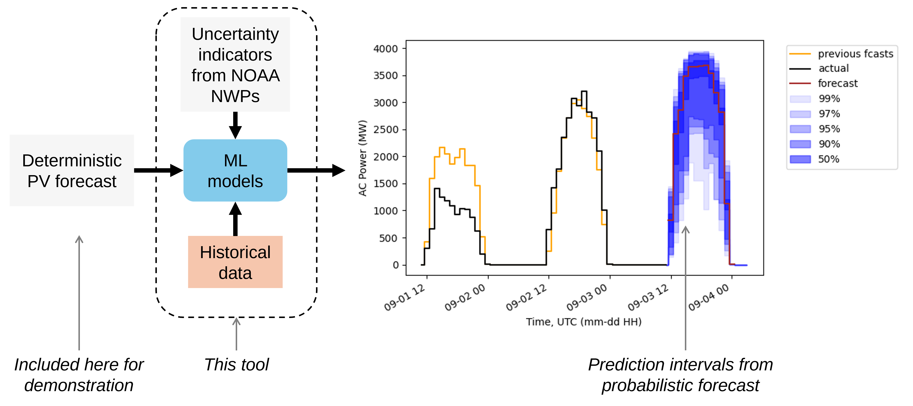

# solar-fleet-forecast-probability-tool
Will Hobbs

2024-04-17
***
This is an open-source tool/framework for making a probabilistic power forecast for a fleet of solar plants using an existing deterministic forecast. It has been developed and demonstrated for day-ahead forecasts, but the structure could be extended to shorter and longer horizons. 

_Note: An accompanying manuscript is being prepared for IEEE PVSC 2024, and will be referenced here when it is available._

Two custom indicators of forecast uncertainty are derived from NOAA numerical weather prediction models (NWPs):
1. Spatial variation in irradiance from the HRRR
2. Ensemble variation in cloud cover from the GEFS

These are fed into two quantile regression models (Random Forest and XGBoost), along with historical deterministic forecasts and actual power, to produce a probabilistic forecast with a range of prediction intervals.

### Spatial variation in irradiance

The NOAA HRRR model is downsampled (coarsened) to find the mean, max, and min irradiance in 10 x 10 windows (approximately 30 x 30 km, from the native approx. 2.8 x 2.8 km). The mean values are used for the deterministic forecast, and the range between the max and min values is used to represent uncertainty. 

### Ensemble variation in total cloud cover

For each of the 30 ensemble members of the NOAA GEFS, a weighted average total cloud cover (TCC) is calculated, wieghted by nameplate capacity of each plant in the fleet. A sample with two plants across three ensemble members is shown below. 

Then, the standard deviation of all the weighted average TCC values is calculated across the 30 members. In the example above, with only three members, the standard deviation is 10.7, a relatively high value, indicating high uncertainty.

### Deterministic forecasts and modeled fleet
The day-ahead deterministic forecasts included here are based on the HRRR and pvlib, and actuals are modeled from HRRR reanalysis and pvlib. A more "real-world" implementation of this might use a commercial deterministic forecast and actual measured power from a fleet of PV plants. 

The solar fleet used is based on EIA Form 860 data for the Southern Company balancing area, filtering on plants larger than 10 MW. It includes about 3700 MW total over about 50 plants.

### Using this repository

Review the Jupyter notebook files in order, starting with [01_intro_to_solar_actuals_and_forecasts.ipynb](01_intro_to_solar_actuals_and_forecasts.ipynb). That notebook includes details on setting up an environment and installing required packages. 

Here is a full list of the notebooks with short descriptions:
- [01_intro_to_solar_actuals_and_forecasts.ipynb](01_intro_to_solar_actuals_and_forecasts.ipynb) 
  - Setup and demonstration of downloading observed weather (from NSRDB) and forecasted weather (from HRRR)    
- [02_solar_power_forecasts.ipynb](02_solar_power_forecasts.ipynb) 
  - Calculating power for a fleet of solar plants  
- [03_considerations_for_actual_weather.ipynb](03_considerations_for_actual_weather.ipynb)  
  - Why we use HRRR for modeling observations instead of NSRDB
- [04_spatial_variation_in_irradiance.ipynb](04_spatial_variation_in_irradiance.ipynb)
  - Our first forecast uncertainty indicator from HRRR
- [05_ensemble_variation_in_cloud_cover.ipynb](05_ensemble_variation_in_cloud_cover.ipynb)
  - Our second forecast uncertainty indicator from GEFS
- [06_indicators_of_forecast_error.ipynb](06_indicators_of_forecast_error.ipynb)
  - Combining the two uncertainty indicators and briefly looking at correlations with forecast error
- [07_get_many_historical_forecasts.ipynb](07_get_many_historical_forecasts.ipynb)
  - Retrieving several years of forecasts and observations (this step can be skipped if you only want to model the fleet of plants included here)
- [08_prep_data_for_machine_learning.ipynb](08_prep_data_for_machine_learning.ipynb)
  - Merging data and a bit of feature engineering
- [09_machine_learning_models.ipynb](09_machine_learning_models.ipynb)
  - Training and evaluating quantile regressions that produce our probabilistic forecast
- [10_operational_forecast_example.ipynb](10_operational_forecast_example.ipynb)
  - Example of how the models could be deployed
- [11_revisting_early_forecast.ipynb](11_revisting_early_forecast.ipynb)
  - A look at an set of example forecasts we created early on, now with probabilistic prediction intervals
- [12_compare_with_persistence_ensemble.ipynb](12_compare_with_persistence_ensemble.ipynb)
  - A comparison of sharpness with a simple persistence ensemble forecast

### (Partial list of) References
This project uses several Python packages, including pvlib, an open-source solar PV modeling package [1, 2], Herbie [3, 4], a package for accessing weather forecast data from NOAA, XGBoost [5], and quantile-forest [6]. Deterministic forecasts are inspired by the Solar Forecast Arbiter [7]. A complete list of references will be in the forthcoming PVSC manuscript. 

[1] William F. Holmgren, Clifford W. Hansen, and Mark A. Mikofski. “pvlib python: a python package for modeling solar energy systems.” Journal of Open Source Software, 3(29), 884, (2018). https://doi.org/10.21105/joss.00884

[2] https://github.com/pvlib/pvlib-python

[3] Blaylock, B. K. (2022). Herbie: Retrieve Numerical Weather Prediction Model Data (Version 2022.9.0) [Computer software]. https://doi.org/10.5281/zenodo.4567540

[4] https://github.com/blaylockbk/Herbie

[5] Tianqi Chen and Carlos Guestrin. "XGBoost: A Scalable Tree Boosting System."Proceedings of the 22nd ACM SIGKDD International Conference on Knowledge Discovery and Data Mining, ACM, 2016. http://doi.acm.org/10.1145/2939672.2939785 (https://github.com/dmlc/xgboost/)

[6] Reid A. Johnson. "quantile-forest: A Python Package for Quantile Regression Forests." Journal of Open Source Software, 2024, https://doi.org/10.21105/joss.05976. 

[7] C. W. Hansen, W. F. Holmgren, A. Tuohy, J. Sharp, A. T. Lorenzo,
L. J. Boeman, and A. Golnas, “The solar forecast arbiter: An open
source evaluation framework for solar forecasting,” in 2019 IEEE 46th
Photovoltaic Specialists Conference (PVSC), 2019, pp. 2452–2457.
[Online]. Available: https://doi.org/10.1109/PVSC40753.2019.8980713 (see also: https://github.com/SolarArbiter/solarforecastarbiter-core)

### Acknowledgements
Thanks to Will Holmgren at DNV for troubleshooting and other assistance with setting up a version of the Solar Forecast Arbiter reference forecasts, which inspired portions of this work. Thanks to David Larson and Dan Kirk-Davidoff at EPRI for inspiration and feedback related to tools and datasets to use in this work. A portion of this work used code generously provided by Brian Blaylock's Herbie python package (\url{https://doi.org/10.5281/zenodo.4567540}) -- thanks to Brian for publishing and maintaining that package, and for responding to requests that helped make this work possible.
